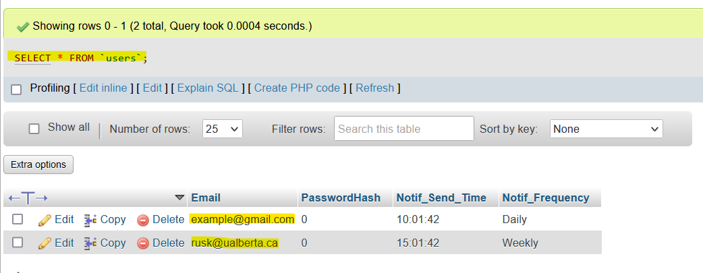

# Run Instructions

1. Clone repository to your local machine.
2. Run `npm install` in order to ensure that all the dependencies are installed. (try npm install in each outer folder individually, e.g., Backend and DearHabits)
3. To run the client and see any changes: 
    - run `npm run dev` in the DearHabits directory and open localhost port 5173 in your browser

    To run the server and see any changes:
    - run `npm start` in the Backend directory
    - this will fetch the db data and host it at localhost port 8081, which the client side App.jsx is hardcoded to fetch data from.
    - while running the backend server like this, any changes made to the database are automatically fetched and supplied to App.jsx, and any changes made in the DearHabits directory are applied to the database where applicable.

5. To shutdown either client or server use `Control C`

# Local Database Results (Mar. 13, 2024)
An example of a simple connection to a local database can be seen in [Backends/server.jsx](Backends/server.jsx). This connector fetches all the entries in the table 'users' and then listens at port 8081 for any database updates.

As of March 13th, 2024, the current 'users' table only has two example entries:

Which can be seen in the DearHabits client app using the ServerConnector defined in App.jsx:
